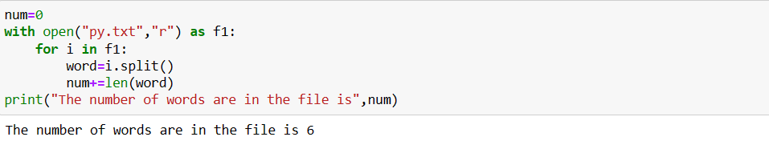

# Word-count
## AIM:
To write a python program for getting the word count from a text.
## EQUIPEMENT'S REQUIRED: 
PC
Anaconda - Python 3.7
## ALGORITHM: 
# Step 1:
Open the file in read mode and handle it in test mood.

# Step 2:
Read the text using read() function.

# Step 3:
Split the text using space separator.We assume that words in a sentance are separted by a space character.

# Step 4:
The length of the split list should equal the numbers of words in the test file.

# Step 5:
You can refine the count by cleaning the string prior to splitting or validating the words after splitting.

# Step 6:
End the program.

## PROGRAM:
```
'''
Developed by: SANIYA G
Reference number: 212223240147
'''
num=0
with open("py.txt","r") as f1:
    for i in f1:
        word=i.split()
        num+=len(word)
print("The number of words are in the file is",num)
```
### OUTPUT:



## RESULT:
Thus the program is written to find the word count from a text.
